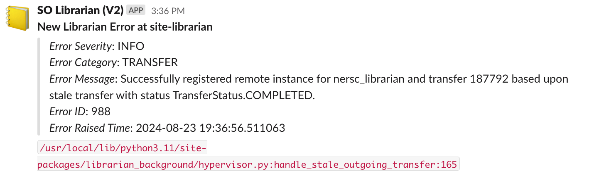
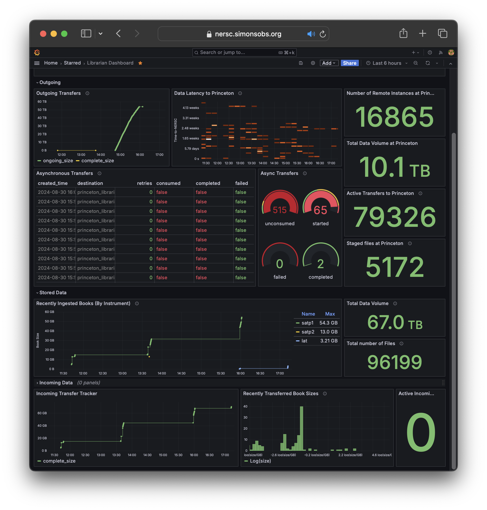

Observability
=============

Observability over your librarian is important when you are running
lots of background transfers, or when you have lots of data.

The librarian provides some basic observability tools through the
python and command-line clients. However, there are three main outlets
from the system that are useful for finding errors and for tracking
progress.

Server logs
-----------

The librarian typically posts a lot of information about incoming
web requests and responses to its logs. You can capture these using
any method you are comfortable with.

Slack
-----

The librarian can post to a slack webhook when it encounters errors.
This web-hook can be configured using the following variables
in the server settings JSON:

- ``slack_webhook_enable``: a boolean switch.
- ``slack_webhook_url_file``: the file containing your webhook URL.
- ``slack_webhook_post_error_severity``: a list of error severities
  that are sent to slack. By default, all.
- ``slack_webhook_post_error_category``: Which error categories to post to slack.
  By default, all errors are sent.

Slack webhooks look like this:

They include a reference to the code file that raised the error, so that
it can be investigated if necessary.

Dashboards (Grafana)
--------------------

It is easy to build dashboards for the librarian. We do not provide a 
default dashboard setup because all librarian setups are unique, with
unique network topologies. These are enabled through direct access
of the librarian database with a SELECT-only account.

The ``librarian-server-setup`` script allows you to create a new role
and account on the database specifically for dashboard applications:

.. code-block::bash
   
   $ librarian-server-setup --create-grafana-user

This creates a new account with the username grafana and a password
that is printed to the screen. You can use this with the postgresql
data source in Grafana (or wherever you want to create your dashboard)
to directly query the librarian database for information about your
files, transfers, instances, remote instances, and more.
